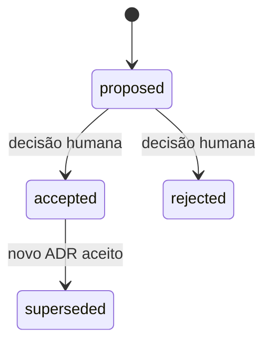

# Padrão de conhecimento 1.0.0

O projeto mantém conhecimento em Markdown, decisões arquiteturais rastreáveis e um índice local do código. O ponto de entrada é [knowledge/index.md](../knowledge/index.md). O padrão pertence a este repositório e não depende do runtime do jogo, de banco de dados ou de um serviço remoto.

## Contratos e responsabilidades

| Camada | Local | Responsabilidade |
| --- | --- | --- |
| Regras do jogo | `docs/` | Visão, padrões e restrições de cada área. |
| Conhecimento OKF | `knowledge/concepts/` | Descrever contratos observados, fontes, limites e relações. |
| Decisões ADR | `knowledge/architecture/decisions/` | Registrar contexto, proposta, alternativas, consequências e decisão humana quando houver. |
| Perfil e configuração | `.knowledge/` | Versionar o padrão, schemas e baseline de fontes. |
| Índice Graphify | `.runtime/knowledge/graphify/` | Localizar símbolos e dependências por extração AST; cache reconstruível. |
| Evidência de validação | `.runtime/knowledge/validation.json` | Registrar o resultado estrutural realmente executado. |

A base adota [Open Knowledge Format v0.2](https://github.com/GoogleCloudPlatform/open-knowledge-format/blob/main/SPEC.md). O formato usa conceitos Markdown com YAML; `type` é o único campo universalmente obrigatório. O [perfil local](../.knowledge/okf-profile.schema.json) acrescenta identidade, título, datas, fontes, tags e relações; esses requisitos são deste projeto. A configuração aplicada é [standard.json](../.knowledge/standard.json).

Índices são navegação e não conceitos. Somente `knowledge/index.md` declara `okf_version: "0.2"`. Logs usam seções `YYYY-MM-DD`, sem frontmatter. Modelos em `.knowledge/templates/` são material de autoria externo ao bundle; todos os demais Markdown dentro de `knowledge/` são conceitos publicados e precisam de frontmatter.

## Metadados e fontes

| Campo | Significado |
| --- | --- |
| `status` | Estabilidade OKF: `draft`, `stable`, `deprecated`. |
| `implementation_status` | Evidência local: `planned`, `partial`, `observed`, `not-applicable`. |
| `decision_status` | Somente ADR: `proposed`, `accepted`, `rejected`, `superseded`. |
| `created`, `updated` | Extensões locais, datas `YYYY-MM-DD`. |
| `sources[].resource` | Material realmente consultado, relativo ao documento; `/` significa raiz do bundle `knowledge/`. |
| `sources[].revision` | SHA-256 opcional da fonte, quando informado e verificado. |
| `relates_to` | IDs locais existentes; extensão para consulta e análise de impacto. |
| `generated`, `verified` | Proveniência e verificações reais; não devem ser inferidas de build, Git ou timestamps. |

Por exemplo, um conceito em `knowledge/concepts/` referencia `../../src/game/world.ts`. IDs locais facilitam consultas; a identidade nativa OKF continua sendo o caminho do conceito dentro do bundle. Fontes externas HTTP(S) podem ser declaradas, mas não são baixadas pelo validador: recebem aviso de não verificação. Referências locais precisam existir dentro do projeto e não podem atravessar links simbólicos.

YAML é lido com schema core e chaves únicas. Aliases, anchors e tags explícitas são rejeitados. Metadados desconhecidos e tipos de conceito adicionais são preservados. O corpo é Markdown livre; a validação de links cobre links inline e referências Markdown fora de blocos de código, incluindo âncoras de títulos Markdown.

Conceitos iniciais são `draft` e `observed`. Os ADRs iniciais estão `proposed`. Esses estados descrevem a inspeção e a proposta implementadas; não atribuem aprovação histórica às escolhas já presentes no jogo.

## Fluxo de manutenção

1. Leia o índice, o conceito e as fontes relevantes. Use `knowledge:query` para encontrar registros e `knowledge:impact` para avaliar fontes e relações declaradas.
2. Implemente a mudança no escopo solicitado; atualize conceitos, datas, índices e o log. Crie proposta ADR se mudar uma escolha material de arquitetura.
3. Confira o texto contra as fontes. Execute `knowledge:baseline` para registrar os hashes da revisão observada. O comando verifica estrutura antes de escrever; não aprova conteúdo nem cria eventos `verified`.
4. Execute `npm.cmd run check`. Ele roda todos os testes da integração, a validação estrutural com detecção de drift e o build TypeScript, nessa ordem.
5. Execute `graphify:refresh` e `graphify:status -- --check`; leia os resultados. Se o provider não estiver disponível, registre a limitação e use fontes diretamente.

```powershell
npm.cmd run knowledge:query -- save
npm.cmd run knowledge:query -- world --limit 5 --json
npm.cmd run knowledge:impact -- src/game/world.ts src/game/world/generation.ts
npm.cmd run knowledge:adr -- "Título de uma nova decisão"
npm.cmd run knowledge:baseline
npm.cmd run check
```

`knowledge:adr` reserva o próximo `ADR-NNNN.md` com escrita exclusiva, preserva arquivos existentes e cria somente uma proposta. Complete as fontes e a justificativa, inclua o registro no índice de decisões e no log antes da baseline. Não existe comando automático de aceitação. A proposta não é considerada concluída apenas por ter sido criada.

`knowledge:baseline` grava [source-baseline.json](../.knowledge/source-baseline.json), com hashes dos conceitos e das fontes locais. Arquivos textuais usam UTF-8 com quebras LF e sem BOM antes do SHA-256, para que o checkout Windows/Linux preserve a evidência; arquivos binários usam bytes exatos. Uma `sources[].revision` explícita continua sendo SHA-256 dos bytes exatos da fonte. O validador falha quando um conceito ou fonte diverge da observação registrada. A baseline não deve ser renovada para esconder drift: inspecione e corrija o texto primeiro. Os relatórios mantêm `semantic: not-verified` e `humanReview: not-verified`.

## Ciclo de ADR

Adote o [modelo ADR](../.knowledge/templates/adr.md). Uma proposta descreve o problema e uma escolha; a aprovação específica da revisão é um ato separado da solicitação geral de implementação.



Ao aceitar ou rejeitar, registre `decided_by: human:<identidade>`, `decision_date` e `approval_reference` indicando a evidência e a revisão examinada. O validador confere a estrutura desse registro; ele não autentica a pessoa nem estabelece que a aprovação ocorreu.

Para substituir uma decisão aceita, crie novo ADR com `supersedes`. Após sua aprovação, marque o anterior `superseded` e preencha `superseded_by`, com relações recíprocas. Preserve o corpo histórico e acrescente o acontecimento ao log. Uma proposta não substitui uma decisão aceita. Não reutilize IDs nem apague decisões rejeitadas/substituídas.

## Graphify local

A integração usa [Graphify 0.9.63](https://github.com/Graphify-Labs/graphify/tree/v0.9.63), distribuído como pacote Python `graphifyy`. A versão está fixada em [requirements-graphify.txt](../scripts/knowledge/requirements-graphify.txt); trata-se da versão adotada e testada, sem alegação de ser a mais recente.

Node.js 22 ou posterior executa as ferramentas. Para instalar o provider, disponibilize `uv`; o setup resolve Python 3.12 e prepara o ambiente isolado em `.runtime/graphify-venv`. A instalação pode acessar o registro de pacotes e baixar o Python necessário. A extração posterior usa somente arquivos locais e não precisa de uma chave de API.

```powershell
npm.cmd run graphify:setup
npm.cmd run graphify:refresh
npm.cmd run graphify:status -- --check
npm.cmd run graphify:query -- SessionSnapshotStore --limit 10 --json
```

A extração usa `--code-only --no-cluster --max-workers 2` sobre uma cópia temporária de código permitido. O wrapper exclui dependências, builds, assets, documentos da extração AST, dados locais e credenciais. Documentos e configuração entram na verificação de freshness quando suportado pelo wrapper; suas relações explícitas permanecem nas ferramentas de conhecimento, sem atribuí-las ao Graphify.

O snapshot registra versão realmente instalada, configuração, hashes e contagens de nós/arestas. Publicação só ocorre após a validação do resultado; falhas preservam o último snapshot íntegro. `graphify:status -- --check` retorna código diferente de zero se o índice estiver ausente, desatualizado ou inválido. A consulta é local e limitada; não realiza busca vetorial nem confirma verdade semântica.

O grafo é um índice derivado. O código define o comportamento observado; conceitos explicam contratos; ADRs registram justificativas e decisões. A ausência de uma aresta não prova ausência de dependência ou impacto.

O manifest expõe referências e imports sem destino resolvido. Imports nativos, pacotes externos, símbolos de runtime e strings de importação dinâmica podem aparecer nessa contagem. Âncoras externas são marcadas como referências; não são apresentadas como arquivos extraídos. A contagem permite avaliar a cobertura e não estabelece que o grafo resolveu todas as dependências.

## Validação e limites

`knowledge:validate` aplica os schemas, valida datas, IDs, navegação, fontes, hashes, links Markdown, relações e coerência de substituição entre ADRs. Registra erros e avisos em `.runtime/knowledge/validation.json` e retorna código diferente de zero em falhas. Não lê ou grava banco de dados.

`npm.cmd run check` é o gate deste repositório Node/TypeScript. O workflow [knowledge-checks.yml](../.github/workflows/knowledge-checks.yml) instala dependências com lockfile e executa o mesmo comando. O CI não instala Python nem usa um grafo pré-gerado como comprovação do código atual.

Esses testes cobrem a infraestrutura de conhecimento e sua integração. O build cobre a compilação do jogo. Nenhuma dessas etapas comprova execução em navegador, desempenho visual, save/load entre versões ou aprovação humana dos ADRs; essas evidências precisam de verificações próprias.
