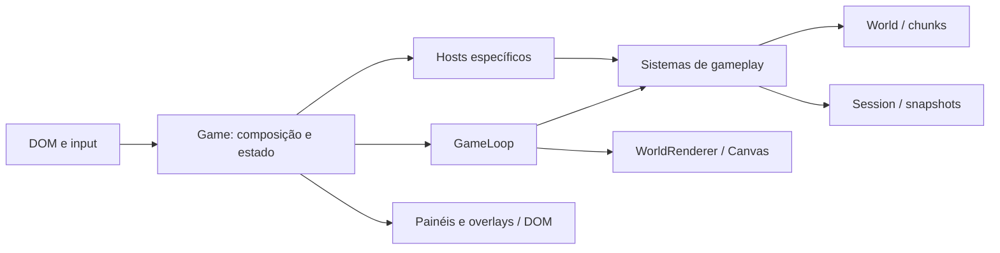

# Arquitetura atual do jogo

## Contexto

O jogo executa no navegador, escrito em TypeScript e desenhado em Canvas 2D. O repositório não depende de uma engine de jogo. O comando de build compila `server.ts` e `src/**/*.ts` para `dist/` com `tsc`; o servidor Node em [server.ts](../../server.ts) serve arquivos estáticos a partir do diretório do projeto. Isso descreve uma aplicação local de aprendizagem; não estabelece requisitos de publicação ou operação em produção.

## Composição e fluxo

O [Game em src/main.ts](../../src/main.ts) cria DOM, estado mutável, input, sistemas, overlays, renderer e loop. Os adaptadores em [system-hosts.ts](../../src/game/runtime/system-hosts.ts) fornecem getters, setters e callbacks específicos aos sistemas, reduzindo o acesso indiscriminado ao objeto `Game`.

O [GameLoop](../../src/game/runtime/game-loop.ts) usa `requestAnimationFrame`, limita `dt` a 0,05 segundo e controla a atualização conforme a sessão e os overlays. A renderização continua enquanto a simulação principal está pausada. As funções `window.render_game_to_text` e `window.advanceTime` são pontos de observação e avanço controlado para validação no navegador; sua existência não comprova que uma validação ocorreu.

Os botões compactos do HUD chamam as operações existentes de inventário, atributos, mapa e pausa pelo OverlayController. A raiz Game fornece o callback de pausa ao SessionSystem; o estado das sessões permanece nos mesmos sistemas. A apresentação oculta o HUD enquanto um overlay está aberto e adapta sua disposição à largura do viewport. Essa integração preserva a composição proposta no ADR-0002.

## Responsabilidades

| Parte | Responsabilidade observada |
| --- | --- |
| `src/game/systems/` | Movimento, combate, progressão, spawn, quests e sessão. |
| `src/game/runtime/` | Loop e contratos de acesso ao estado dos sistemas. |
| `src/game/state/` | Factories, fórmulas, animação e transformações de estado. |
| `src/game/types/` | Tipos de runtime e snapshots. |
| `src/game/world/` | Geração procedural e consultas por chunks. |
| `src/game/render/` | Orquestração Canvas, camadas, sprites e materiais. |
| `src/game/ui/` | Elementos DOM, overlays, painéis e mapa. |

[CombatSystem](../../src/game/systems/combat-system.ts) é uma fachada composta de serviços especializados. [SessionSystem](../../src/game/systems/session-system.ts) compõe ciclo de vida e snapshot store. Inimigos utilizam uma classe base com especializações; a composição dos sistemas não implica proibir toda herança.

## Impacto de alterações

Ao adicionar um sistema, mantenha explícitos o estado que ele lê e altera e os callbacks necessários. Mudanças no loop exigem revisar pausas, overlays, timers e validações de avanço controlado. Mudanças de responsabilidades ou dependências entre camadas exigem avaliar [ADR-0002](../architecture/decisions/ADR-0002.md); contratos de mundo, save e renderização estão nos [conceitos relacionados](../index.md#conceitos).

## Evidência e limites

Este documento foi produzido por leitura das fontes listadas. Não representa uma análise de desempenho, execução de gameplay ou revisão humana. A proposta de preservar este desenho está em [ADR-0002](../architecture/decisions/ADR-0002.md), sem inventar a justificativa histórica dos autores.
