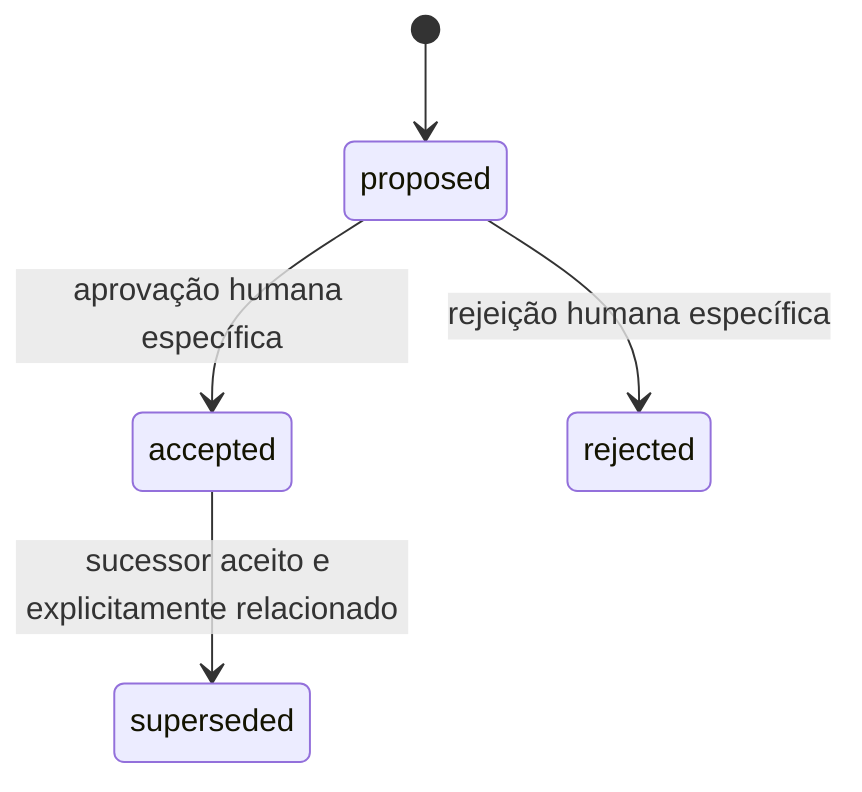

# Manutenção de ADR, OKF e Graphify

## Padrão e perfil local

A base usa [Open Knowledge Format v0.2](https://github.com/GoogleCloudPlatform/open-knowledge-format/blob/main/SPEC.md): Markdown com frontmatter YAML. `type` é a exigência universal de um conceito; tipos são extensíveis. Esta integração acrescenta um perfil local mais explícito. Seus requisitos não devem ser descritos como obrigatórios em toda implementação OKF.

| Campo do perfil | Regra |
| --- | --- |
| `type` | Tipo do conceito; por exemplo, `Software Component`, `Domain Concept`, `Workflow` ou `Architecture Decision`. |
| `id` | Identificador único no projeto; conceitos usam slug e ADRs usam `ADR-NNNN`. |
| `title` | Título legível do documento. |
| `status` | Estabilidade documental OKF: `draft`, `stable` ou `deprecated`. |
| `implementation_status` | Evidência de implementação: `planned`, `partial`, `observed` ou `not-applicable`. |
| `created`, `updated` | Datas reais no formato `YYYY-MM-DD`; criação e última atualização material. |
| `sources` | Lista de objetos com `resource` relativo ao documento; `id`, `title` e `revision` são opcionais. |
| `relates_to` | Lista de IDs existentes no projeto; extensão local para relações de conhecimento. |
| `tags` | Lista de termos para busca. |

Um `resource` relativo resolve a partir do diretório do documento: um conceito usa `../../src/...` e um ADR usa `../../../src/...`. Um caminho começando com `/` resolve a partir da raiz da base `knowledge/`, conforme OKF. A fonte deve existir e permanecer dentro do projeto. Uma `revision` SHA-256, quando registrada, é a revisão realmente lida; drift exige revisão e não deve ser resolvido apenas substituindo hashes sem conferir o documento. Não invente eventos `verified`, autores, revisores ou datas de aprovação.

Os conceitos iniciais ficam `draft` com implementação `observed`: houve leitura do código, mas ainda não há uma revisão semântica humana registrada. Estabilizar um documento e aceitar uma decisão são atos distintos.

Conceitos e ADRs têm frontmatter. O [índice](../index.md) usa apenas `okf_version: "0.2"`; o [log](../log.md) usa entradas datadas sem frontmatter de conceito. Os [modelos](../index.md#referências-e-modelos) explicam o perfil e ficam em `.knowledge/templates/`, fora do bundle publicado: assim todos os Markdown não reservados do bundle são conceitos OKF.

## Ciclo de ADR

Uma decisão arquitetural material deve explicar contexto, proposta, alternativas, consequências e evidência. Use o [modelo](../../.knowledge/templates/adr.md), escolha o próximo ID ainda não usado e não reutilize um identificador histórico.

`decision_status` é independente de `status` e `implementation_status`: permite `proposed`, `accepted`, `rejected` ou `superseded`. Um código já existente pode motivar um ADR `proposed` com implementação `observed`; isso não o transforma em uma decisão historicamente aceita.



Os ADRs acrescentam `decision_status`, `decision_date` e `supersedes`. Uma proposta usa `decision_date: null` e normalmente `supersedes: null`. Aceitação ou rejeição exige uma decisão humana real, registrada com `decided_by: human:<identidade>`, data e `approval_reference` identificando a aprovação e a versão revisada no corpo/log. A solicitação genérica de implementação e o resultado de um comando não devem ser convertidos em aprovação individual de ADRs.

Um sucessor proposto não torna seu predecessor `superseded`. Após aprovação específica do sucessor, registre `supersedes` no novo ADR, `superseded_by` no anterior, relações recíprocas e entrada no log. Preserve o contexto e a justificativa anteriores; não apague ADRs rejeitados ou substituídos. Correções factuais devem manter a rastreabilidade; mudanças materiais de decisão exigem novo ADR.

## Graphify e autoridade das fontes

O Graphify produz um índice derivado local do código. O modo adotado é `--code-only --no-cluster`, sem análise por LLM, transmissão do repositório ou hooks instalados no projeto. Relações Markdown e `relates_to` são conhecimento explícito deste perfil; não atribua essa capacidade ao Graphify sem evidência de suporte do provider.

O código define o comportamento observado; conceitos descrevem esse comportamento; ADRs registram decisões e justificativas; o grafo auxilia a localizar símbolos e dependências. Um grafo não aprova decisões, garante a verdade de um conceito ou estabelece compatibilidade de saves.

Snapshots devem ser isolados por projeto, registrar provider e versão realmente usados, configuração e fingerprints das fontes. Exclua credenciais, arquivos de ambiente, dados de runtime, caches e artefatos gerados. Uma atualização falha deve preservar o último snapshot íntegro. Se o índice estiver ausente ou desatualizado, declare a limitação e consulte documentos e fontes diretamente.

## Arquivos versionados e exclusões locais

O [.gitignore](../../.gitignore) exclui dependências, build, runtime/instalação Graphify, evidências em `output/`, cobertura/caches, o diário local `progress.md`, logs, configurações de editor, temporários/backups, ambientes/credenciais e arquivos locais de banco. Essas regras preservam os arquivos no disco. Templates `.env.example` e `.env.*.example` continuam elegíveis para versionamento.

Código, testes, scripts, lockfile, workflow de CI, regras do projeto, documentação e o bundle `.knowledge/`/`knowledge/` pertencem ao repositório. Assets PNG/JSON, fontes Aseprite, previews e referências de arte também são mantidos: as referências `*-generated.png` são entradas dos preparadores, não artefatos descartáveis de build. A baseline é evidência de hashes observados, enquanto o índice Graphify derivado permanece local. Preparar o stage exige solicitação explícita; stage não cria commit nem publica no GitHub.

## Rotina de manutencao

1. Comece pelo [índice](../index.md), conceitos relevantes e ADRs relacionados. Leia as fontes necessárias antes de alterar o projeto.
2. Determine o impacto: comportamento, fontes, contratos, decisões e compatibilidade. Ausência de uma relação no grafo não prova ausência de impacto.
3. Atualize o conceito afetado, datas e relações. Crie um ADR quando mudar uma escolha material de arquitetura.
4. Acrescente uma entrada material ao [log](../log.md), descrevendo fatos e limites de evidência.
5. Execute a validação estrutural e atualize o grafo usando os comandos publicados no [README](../../README.md). Leia seus resultados efetivos; não marque testes ou revisão semântica como aprovados por inferência.
6. Quando as fontes tiverem mudado, revise o texto antes de renovar a baseline de hashes. Registre resultados de execução onde forem gerados e preserve limitações relevantes.

## Limites da validação

Validação estrutural verifica metadados, IDs, relações, caminhos, links e coerência de estados. Ela não confirma toda a semântica do jogo, aprovação humana, desempenho, migração de saves nem reprodução em navegador. O build TypeScript e a extração Graphify também têm limites próprios; documente separadamente cada resultado real.

A proposta que fundamenta esta rotina é [ADR-0001](../architecture/decisions/ADR-0001.md). Os comandos exatos e os pré-requisitos instaláveis são mantidos no README para evitar instruções divergentes.

## Comandos locais

Execute os comandos a partir da raiz do projeto. Argumentos de impacto usam caminhos relativos ao repositório, diferentemente dos `resource` document-relative do OKF.

```powershell
npm.cmd run knowledge:validate
npm.cmd run knowledge:query -- save
npm.cmd run knowledge:impact -- src/game/world.ts src/game/world/generation.ts
npm.cmd run knowledge:adr -- "Descrição da nova proposta"
npm.cmd run graphify:setup
npm.cmd run graphify:refresh
npm.cmd run graphify:status -- --check
npm.cmd run graphify:query -- World
```

`graphify:setup` prepara a instalação local isolada do provider; não faz parte do runtime do jogo. Um refresh calcula um índice de código e seu estado observado; não registra aprovação semântica.

Após conferir as fontes e atualizar os conceitos afetados, `npm.cmd run knowledge:baseline` registra hashes observados em `.knowledge/source-baseline.json`. Isso permite detectar alterações futuras; o comando não verifica sozinho a precisão do texto nem registra aceitação de ADR. A configuração do perfil está em `.knowledge/standard.json`.
